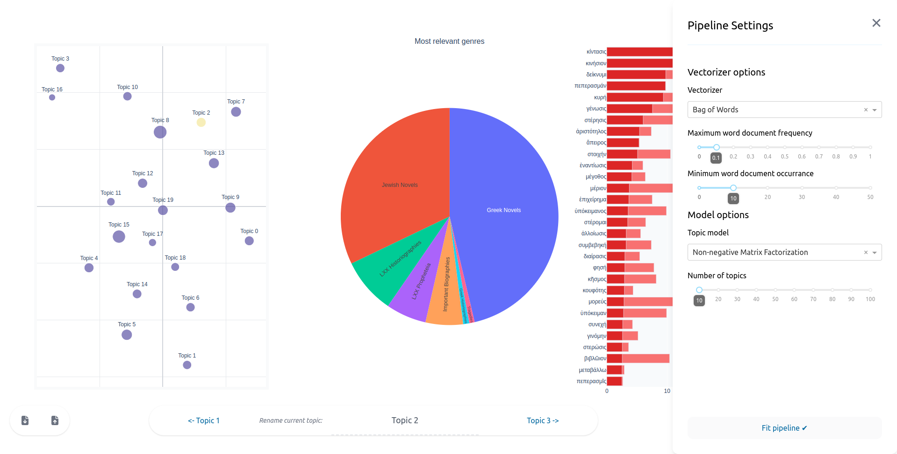

# Topiquity

[](https://black.readthedocs.io/en/stable/the_black_code_style/current_style.html)
[](https://lbesson.mit-license.org/)
[](https://https://docker.com/)
[](https://www.python.org/)

Web application for dynamic topic modelling on classical texts in the "Computing antiquity" project.



## Setup

In order for the application to run properly you will need a `dat/cleaned_corpus.csv` in the working directory. <br>
This file has to contain a table with one column being `id_nummer` containing the IDs of the texts,
the other being `text` containing a whitespace-separated cleaned texts. <br>

### Debugging

For debugging purposes (or if you're just lazy to mess with docker) you may run the app by installing dependencies:

```bash
pip install -r requirements.txt
```

Then run the main script in the following fashion:

```bash
cd src && python3 main.py
```

The server will listen at `localhost:8080`, you are free to open it up in your browser.

### Deployment

Both a Dockerfile and a docker compose default configuration is included in the repository, these might aid you in deploying the application to a webserver of some sorts, or just run the app on your computer in an isolated environment.
It's easiest to get started by running the app in docker compose:

```bash
docker compose up
```

This will spin up a container and attach to `localhost:7011`

## Known limitations

- DMM and LSI don't work particularly well, sometimes not at all, you should use LDA or NMF as things stand right now. A project-agnostic topic investigation platform might be developed in the near future.
- The code is heavily project-specific, if you want to use the application with a different corpus you will have to dig deep into the code.
